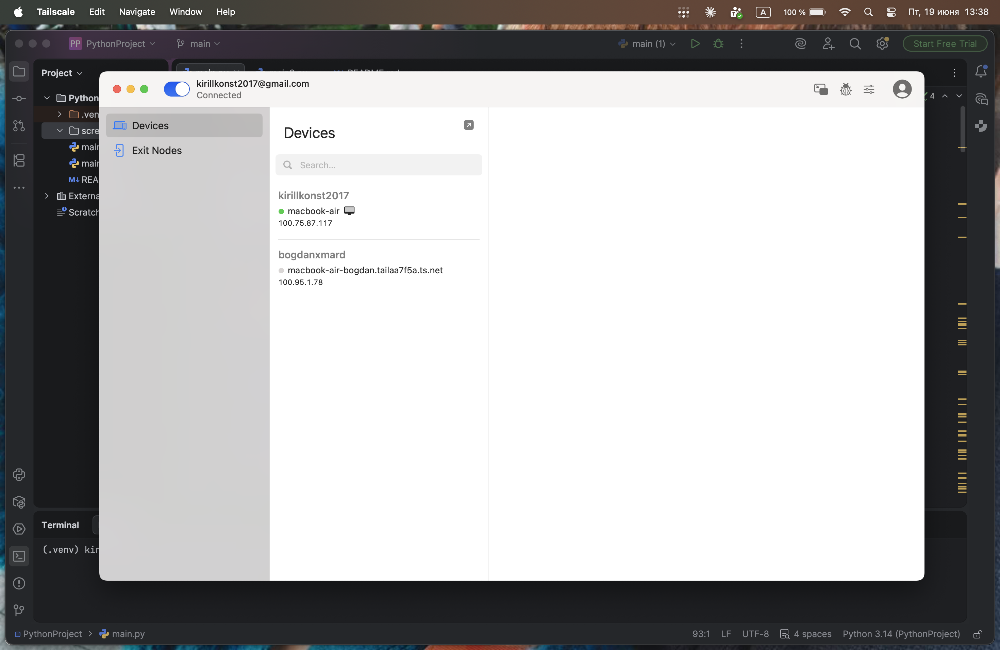

# P2P Video Call App

A peer-to-peer video calling application built with Python. No servers, no accounts — just two machines talking directly to each other over TCP.

---

## Screenshots

<p align="center">
  
  
  
</p>

---

## Overview

Most video call apps rely on central servers to relay media. This one skips all of that — two machines connect directly over raw TCP sockets, stream compressed video frames and PCM audio in full duplex, and display everything in a minimal Tkinter UI.

The project works on a local network out of the box. For calls over the internet, both users connect through Tailscale VPN and use their `100.x.x.x` address.

---

## How It Works

```
Host                          Guest
 |                              |
 |-- listens on TCP :9999 ----->|-- connects to host:9999 (video)
 |-- listens on TCP :8888 ----->|-- connects to host:8888 (audio)
 |                              |
 |<======= video frames =======>|
 |<======= audio chunks =======>|
```

Each frame and audio chunk is prefixed with a 4-byte big-endian length so the receiver knows exactly how many bytes to read from the TCP stream.

---

## Features

- Live video — see both yourself and your peer in real time
- Full-duplex audio transmission
- Mute button — silence your mic without ending the call
- Works over the internet via Tailscale VPN
- Dark UI built with Tkinter

---

## Tech Stack

| Layer | Tools |
|---|---|
| Transport | TCP sockets (raw Python `socket`) |
| Video | OpenCV capture → JPEG encoding → TCP stream |
| Audio | sounddevice (PortAudio) PCM stream over TCP |
| UI | Tkinter + Pillow for frame rendering |
| Framing | 4-byte length prefix before each video/audio chunk |

---

## Project Structure

```
Video-Caller/
├── screenshots/     # demo screenshots
├── main.py          # main application
├── main2.py         # identical copy for local testing
├── requirements.txt # Python dependencies
└── setup.sh         # macOS PortAudio build script
```

---

## Getting Started

```bash
pip install -r requirements.txt
```

On macOS, if `sounddevice` fails to build, run `bash setup.sh` first — it compiles PortAudio from source.

---

## Usage

Both users run the same `main.py`. One acts as **Host**, the other as **Guest**.

**Host:**
1. Check "I'm host"
2. Click Call
3. Share your IP with your peer

**Guest:**
1. Enter the host's IP address
2. Click Call

To call over the internet, both users need Tailscale installed and connected to the same network. Use the `100.x.x.x` Tailscale IP.

---

## Local Testing

Run `main.py` and `main2.py` simultaneously on the same machine:

- `main.py` — check "I'm host" → Click Call
- `main2.py` — enter `127.0.0.1` → Click Call
